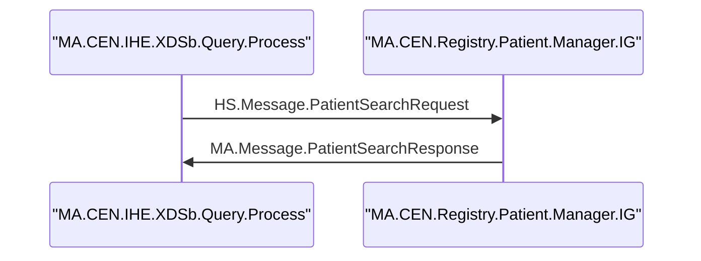
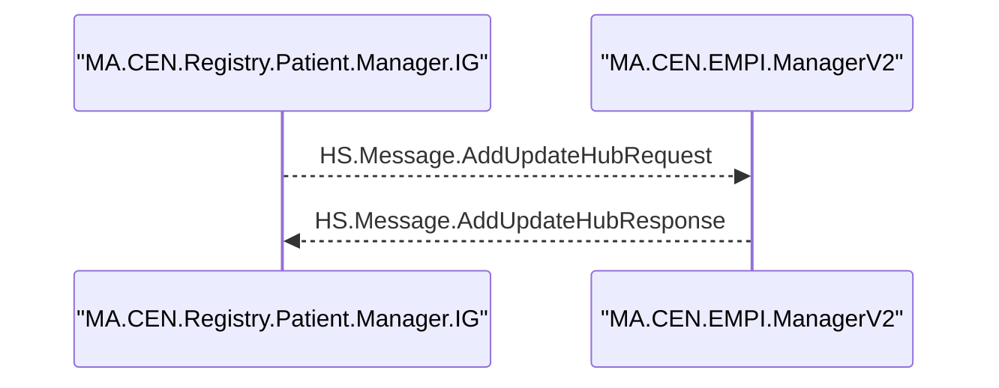
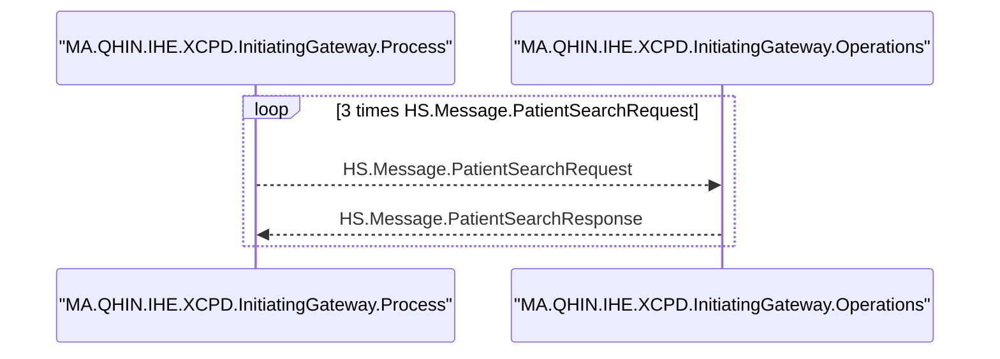

# PRD v4 Shard — 50 Diagramming Rules (Mermaid): MALIB.Util.DiagramTool

Status: Draft v4
Owner: PM (BMad)
Related: ../prd.md, 00-overview.md, 20-functional-requirements.md, 40-data-sources-and-mapping.md

1) Mermaid Primer (Sequence Diagrams)
- Each diagram starts with:
  sequenceDiagram
- Participants (actors) are declared once:
  participant <id> as "<label>"
- Messages are emitted in order with arrows
- Comments use:
  %% Comment here

Reference: https://mermaid.js.org/syntax/sequenceDiagram.html

2) Participants (Actors)
- Source of truth: first appearance of SourceConfigName and TargetConfigName in ordered rows
- Declaration order: order-of-first-appearance in the session
- Identifier vs Label:
  - Identifier (<id>): Mermaid-safe (see Sanitization)
  - Label: Original config name (quoted)
- Example:
  participant MA_CEN_IHE_XDSb_Query_Process as "MA.CEN.IHE.XDSb.Query.Process"

3) Sanitization Rules (Identifiers)
- Allowed: [A-Z][a-z][0-9] and underscore (_)
- Replace any other character with underscore (_)
- Identifiers must be unique. On collision, append numeric suffix: _2, _3, …
- Labels preserve original names (quoted). No truncation of identifiers or labels.

4) Message Labels (Default = Full Class Name, Toggle supported)
- Base format:
  <srcId> <arrow> <dstId>: <Label>
- Default label: full MessageBodyClassName (including package), sanitized for Mermaid if needed
  - Example: HS.Message.PatientSearchRequest → "HS.Message.PatientSearchRequest"
- Runtime toggle labelMode=full|short (default=full)
  - short = last segment after "." (e.g., PatientSearchRequest)

5) Arrow Semantics (Invocation → Arrow)
- Recognized (case-insensitive): Inproc (sync), Queue (async)
- Mapping:
  - Inproc: ->>
  - Queue: both request and response arrows are async -->> (response always async regardless of its row Invocation)
- Unknown Invocation values: emit a warning via "%%" and default to Inproc (sync) behavior for that message

6) Request/Response Direction
- Requests: Src → Dst using Invocation-mapped arrow
- Responses:
  - Inproc: Dst → Src (reverse of request direction), arrow ->>
  - Queue: Dst → Src (reverse), arrow always -->> for queued pairs

7) Pair-Level Loop Compression (ST-004)
- Definition: Contiguous pairs of request/response with identical signature
  - Signature includes Req(Src, Dst, Label, Arrow) and Resp(Src, Dst, Label, Arrow)
- When repeated N>1 times, compress:
  ```mermaid
  loop N times <Label>
    <Req line>
    <Resp line>
  end
  ```
- Do not compress if pairs are interrupted by other messages with different signatures
- Arrow semantics (Inproc vs Queue) are preserved from correlation

8) Episode-Based Loop Compression (ST-008)
- Definition: An **episode** is a higher-level transactional call flow built from the correlated event stream **after** ST-004:
  - Typically initiated by a root business Request (e.g., XDS/XCPD queries, AddUpdateDocument flows).
  - May span multiple hops (A → B → C → … → B → A) before resolving.
  - Internally represented as an `Episode` object with an ordered collection of events.
- Episode signatures:
  - For each episode, a canonical **episode signature** is computed from **business-relevant events only**:
    - Each business line contributes:
      - `Src | Arrow | Dst | NormalizedLabel(full) | Invocation | EventType`.
    - **Trace/log events** (e.g., `HS.Util.Trace.*`) are:
      - Included inside the episode for context, but
      - **Ignored** when computing the episode signature.
  - Two episodes are considered equal if and only if:
    - They have identical sequences of business event signature fragments.
    - Differences in trace/log events do **not** change equality.
- Episode-based loops:
  - After episodes are identified and signatures computed, the system:
    - Scans the ordered sequence of episodes.
    - Detects **contiguous runs** of episodes with identical signatures.
    - Compresses such runs into:
      ```mermaid
      loop N times <label>
        <canonical episode body (one episode)>
      end
      ```
      where:
      - `N` is the count of repeated episodes.
      - The inner body is a canonical rendering of **one** episode.
      - The canonical body includes all events for that episode, including any trace/log events, in their original relative positions.
  - Loop labels:
    - Use a representative business label from the episode (typically the primary request’s MessageBodyClassName).
    - Respect existing `labelMode` rules (`full` vs `short`) when rendered.
- Determinism:
  - Given a fixed correlated event stream (after ST-004) and configuration:
    - Episode boundaries and signatures are deterministic.
    - Episode-based `loop N times` blocks appear in the **same places** with the **same counts** across runs.
    - Trace/log events do not cause two semantically identical business episodes to be treated differently.

9) Comments, Warnings, and Session Header
- Optional header to annotate session:
  %% Session <SessionId>
- Non-fatal warnings (e.g., unknown Invocation, conflicting CorrespondingMessageId, unpaired queued response) should be emitted as "%%" comments near the relevant lines where feasible
- When writing multiple diagrams to a file, insert a divider:
  %% ---

10) Deduplication (Multi-Session Runs)
- When multiple sessions are requested, diagrams may be identical
- Compute stable hash of the full diagram text (using a normalized key that hides the specific SessionId)
- Deduplication is ON by default; only output unique diagrams
- Silent deduplication: do not emit a summary of removed SessionIds

11) Minimal Diagram on Empty Data
- If a session yields no rows after filtering, emit:
  ```mermaid
  sequenceDiagram
  %% Session <SessionId>
  %% No data available (filtered or empty)
  ```
- Rationale: valid Mermaid output is always produced

12) Examples

Example A — Synchronous (Inproc) with full class labels


Example B — Queued pair (both legs async -->>) correlated via CorrMsgId


Example C — Pair-Level Loop Compression (Contiguous Identical Pairs)


13) Edge Handling
- Non-ASCII in labels: allowed; only identifiers are sanitized
- Missing Source/Target:
  - If either side is blank, skip message or emit a "%%" note, preferring best-effort output over failure
- Ties on TimeCreated:
  - Break ties by ID to maintain determinism

14) Formatting Consistency and File Appends
- Maintain a blank line between diagrams in the combined text result
- On file output, use append-only and add "%% ---" divider between diagrams
- Keep comments concise; avoid flooding the diagram with metadata

Traceability
- FR-04 (Actors), FR-05 (Labels), FR-06 (Arrows), FR-08 (Pair-level loops), FR-09 (Per-session), FR-10 (Dedup), FR-11 (Append-only)
- Episode-based loop compression (ST-008) refines FR-09/FR-10 loop semantics at the **episode** level while preserving existing ST-004 behavior
- Aligns with NFR-02 (Determinism) and NFR-03 (Resilience)
